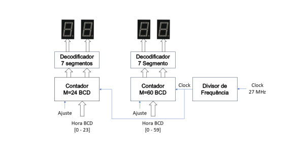

# Temporizador Digital Regressivo
## Componentes do Grupo
- [Lucas Lemes](https://github.com/L3mSv)

## Introdução
   

Implementação de um temporizador digital a partir de circuitos contadores regressivos (Binary-coded Decimal)
módulos módulo 60 e 24 com saídas conectadas a decodificadores para display 7 segmentos - 4 dígitos.

